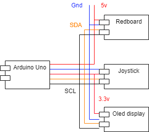

# i2cSnake
This project showcases how i2c communication can be used to coordinate usage of a single oled display between multiple microcontrollers.

## Project concept
For this project I want to recreate the classing game [snake](https://en.wikipedia.org/wiki/Snake_(video_game_genre)). Where you play as a snake and have to eat bits on the screen to grow in size. In addition, I want to keep track of and display high-scores after each game over.  
In this project, 1 microcontrollers controls the game and the other controls the highscores. Both microcontrollers use a simple communication protocol to coordinate which microcontroller has control of the display at what time.

## Hardware
The following hardware was used for this project:
* [Arduino Uno](https://store.arduino.cc/arduino-uno-rev3)
* [Sparkfun RedBoard](https://www.sparkfun.com/products/13975)
* [Sparkfun Qwiic Joystick](https://www.sparkfun.com/products/15168)
* [SparkFun Micro OLED Breakout (Qwiic)](https://www.sparkfun.com/products/14532)

The acquired hardware will be wired up as according to the diagram below:

The responsibility of each device is as follows:

| Device       | Responsibility                            |
|------------- |-------------------------------------------|
| Arduino uno  | Handles game logic                        |
| Redboard     | Handles high-score screen                 |
| Joystick     | Input device for the system               |
| Oled display | Output display for the system             |

---

## Todos
- [ ] Add protocol documentation
